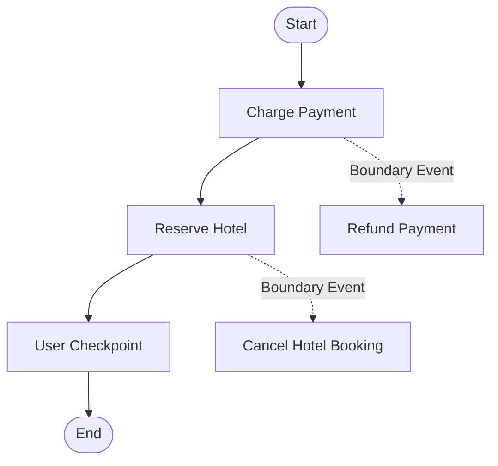

# BPMN 2.0 Saga Pattern (Compensation) Example

Этот пример демонстрирует использование транзакционных компенсаций (Saga Pattern) в BPMN-движке.

Компенсации используются для отката уже выполненных шагов процесса в случае сбоя на последующих этапах. Каждая бизнес-операция (например, резервирование отеля или списание средств) имеет ассоциированное граничное событие компенсации, указывающее на отменяющее действие (возврат средств или отмена брони).

## Схема процесса



## Как запустить

Для запуска примера выполните:

```bash
go run main.go
```

Вы увидите пошаговый вывод работы процесса, фиксацию истории выполненных шагов, симуляцию сбоя и последовательный вызов компенсирующих задач.
