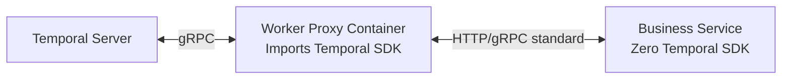

# Безопасность интеграции с Camunda и Temporal (Защита от CVE)

Предлагается архитектурное решение для интеграции с Camunda BPM и Temporal.io, которое минимизирует зависимость от CVE во внешних библиотеках и SDK.

## Архитектурные риски и цели

1. **Загрязнение транзитивных зависимостей (Dependency Pollution)**:
   - Официальный Temporal Go SDK (`go.temporal.io/sdk`) импортирует большой стек библиотек (gRPC, protobuf, x/net), которые часто содержат критические CVE (например, уязвимости HTTP/2 Rapid Reset, переполнение буфера в protobuf парсерах).
   - Импорт этого SDK напрямую в бизнес-микросервисы вынуждает пересобирать, тестировать и развертывать все сервисы при обнаружении любой CVE в инфраструктурном слое.
2. **Несанкционированное выполнение кода (RCE)**:
   - Скрипты (Groovy/Javascript/Feel) внутри Camunda Engine или недетерминированный код в воркерах Temporal могут привести к компрометации среды выполнения.
3. **Утечка конфиденциальных данных**:
   - Хранение открытых бизнес-данных и секретов в базах данных и логах оркестраторов (Camunda DB, Temporal History).

---

## Предлагаемые решения (Proposed Changes)

### 1. Zero-SDK / Low-Dependency архитектура

Для устранения транзитивных CVE из бизнес-приложений предлагается разделить их код и SDK оркестраторов.

* **Для Camunda BPM**:
  - Использовать уже реализованный в репозитории легковесный REST-клиент на базе стандартной библиотеки Go (`net/http`) и [httpstream](file:///Users/user/github.com/nativebpm/connectors/httpstream/).
  - Этот клиент имеет **ноль** внешних зависимостей, кроме `uuid` и `sequin-go`, что делает его практически неуязвимым к классическим CVE тяжелых фреймворков.

* **Для Temporal (Sidecar / Proxy Worker Pattern)**:
  - Вместо прямого импорта `go.temporal.io/sdk` в каждый микросервис, внедрить паттерн **Sidecar** (или выделенный контейнер-прокси).
  - Воркер-прокси (написанный на Go) импортирует Temporal SDK, слушает очередь задач (Task Queue) и делегирует выполнение конкретных шагов (Activity) в бизнес-микросервис через локальный HTTP REST / gRPC API.
  - Бизнес-микросервис использует только стандартную библиотеку для обработки запросов от прокси-воркера и не содержит зависимостей от Temporal SDK. При обнаружении CVE в Temporal SDK обновляется и пересобирается только образ прокси-воркера.



---

### 2. Делегирование задач через CDC (WAL CDC via Sequin)

Этот паттерн уже заложен в текущей кодовой базе (`camunda_sequin.go` и `temporal/cdc.go`). Рекомендуется сделать его основным стандартом интеграции.

* **Безопасность сетевого контура**: Воркеры не опрашивают движки Camunda/Temporal напрямую под нагрузкой. Они читают задачи через HTTP-опрос Sequin.
* **Изоляция СУБД**: Воркеры имеют **нулевой прямой доступ** к базе данных Camunda/Temporal. Они не знают реквизитов подключения к БД, что исключает риск утечки учетных данных или SQL-инъекций через слой воркеров.
* **Управление трафиком**: Sequin выступает буфером, защищающим от DDoS-атак на инфраструктуру оркестрации.

---

### 3. Слой шифрования данных (Zero-Trust Data Plane)

Для защиты данных от утечки при компрометации Camunda/Temporal:

* **Temporal DataConverter**:
  - Использовать кастомный `DataConverter` (Payload Codec) на стороне клиента перед отправкой данных в Temporal Server.
  - Данные (аргументы и результаты Workflow/Activity) шифруются симметричным ключом (например, AES-GCM) до отправки.
  - Temporal Server видит только зашифрованные байты (`Payload`). В случае эксплуатации CVE на сервере Temporal, злоумышленник не получит доступ к бизнес-данным.
* **Camunda Variables**:
  - Тяжелые или чувствительные данные процесса хранить во внешнем защищенном хранилище (например, PostgreSQL бизнес-сервиса, Redis с TLS или HashiCorp Vault).
  - В переменные процесса Camunda передавать только ссылки (например, UUID записи) и `businessKey`, исключая хранение персональных данных (PII) и коммерческой тайны непосредственно в Camunda.

---

### 4. Песочница (Sandboxing) и ограничение выполнения кода

* **Для Camunda BPM**:
  - Полностью отключить или жестко ограничить внутренние скрипты (Groovy, JavaScript) в конфигурации движка:
    ```xml
    <property name="enableScriptEngine">false</property>
    ```
  - Использовать исключительно **External Tasks**. Бизнес-логика должна выполняться на удаленных воркерах, а не внутри JVM Camunda.
* **Для Temporal Workers**:
  - Запускать контейнеры воркеров в режиме `read-only` файловой системы с минимальными привилегиями (non-root).
  - Использовать сетевые политики (Kubernetes NetworkPolicies), разрешающие воркерам доступ только к Temporal Server / Sequin и целевым микросервисам.
  - Для выполнения недоверенного кода (если применимо) использовать песочницы уровня ядра (gVisor или Firecracker microVMs).

---

### 5. Непрерывный аудит (DevSecOps)

* Интегрировать в CI/CD утилиту `govulncheck` для автоматического сканирования зависимостей Go на известные CVE при каждой сборке.
* Генерировать SBOM (Software Bill of Materials) в формате CycloneDX/SPDX для отслеживания всех транзитивных зависимостей.

---

## План верификации (Verification Plan)

### Автоматические тесты
1. Запуск `govulncheck ./...` для подтверждения отсутствия известных CVE в текущих зависимостях модулей `camunda` и `temporal`.
2. Тестирование сквозного выполнения задач через Sequin CDC для подтверждения работоспособности Zero-DB схемы.

### Ручная верификация
1. Проверка настроек TLS/mTLS для gRPC соединений с Temporal.
2. Проверка изоляции переменных в Camunda (убедиться, что PII-данные не попадают в БД Camunda).
